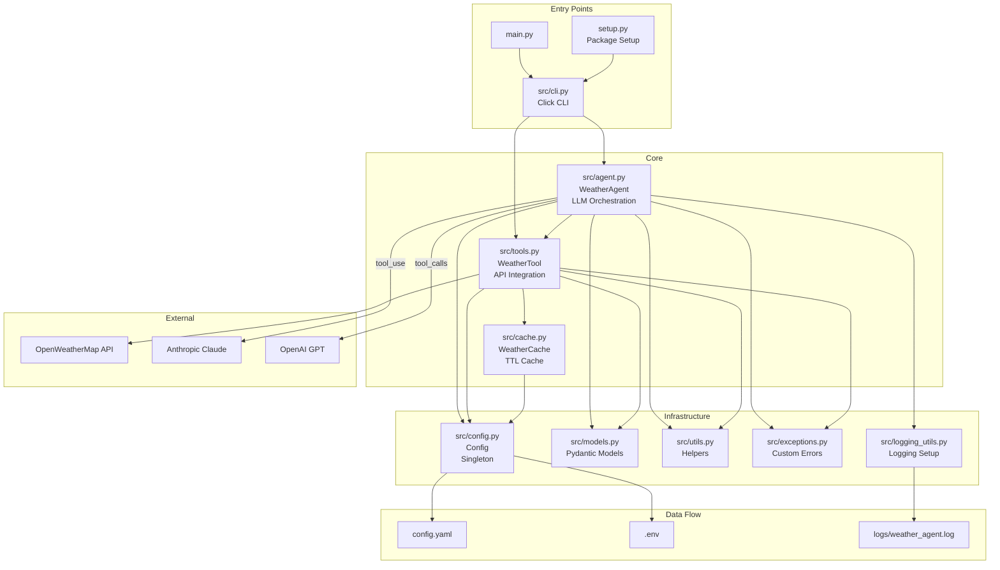

# Weather Agent

AI-powered weather information agent with CLI support, caching, LLM-assisted conversational responses, and OpenWeatherMap integration.

## Features

- **Current weather lookup** by city name
- **Weather forecast** (up to 5 days)
- **Geocoding** - city name to coordinates and reverse
- **Conversational weather assistant** with multi-turn context
- **Configurable LLM provider** - Anthropic Claude or OpenAI GPT
- **TTL-based caching** for weather, forecast, and geocode data
- **Input sanitization** and API key format validation
- **Structured error handling** with user-friendly messages
- **Rate limiting** utilities
- **Rotating file logging** with configurable levels
- **CI pipeline** - lint, type-check, and tests via GitHub Actions

---

## Architecture



### Request Flow

```
User Input --> CLI (src/cli.py) --> WeatherAgent (src/agent.py)
                                          |
                                          v
                                  LLM Provider (Anthropic/OpenAI)
                                          |
                                     tool_use / tool_calls
                                          |
                                          v
                                  WeatherTool (src/tools.py)
                                          |
                                    +-----+------+
                                    |            |
                              Cache Check   API Request
                           (src/cache.py)  (OpenWeatherMap)
                                    |            |
                                    +-----+------+
                                          |
                                          v
                                  Format & Return Response
                                          |
                                          v
                                   CLI Output to User
```

---

## Project Structure

```
weather-agent/
├── main.py                    # Entry point
├── setup.py                   # Package setup
├── config.yaml                # App configuration
├── requirements.txt           # Dependencies
├── .env.example               # Environment variables template
├── .github/workflows/ci.yml  # CI/CD pipeline
├── src/
│   ├── __init__.py
│   ├── cli.py                 # Click CLI interface
│   ├── agent.py               # WeatherAgent - LLM orchestration
│   ├── tools.py               # WeatherTool - OpenWeatherMap API
│   ├── cache.py               # TTL-based caching layer
│   ├── config.py              # Singleton config manager
│   ├── models.py              # Pydantic data models
│   ├── utils.py               # Helpers & converters
│   ├── exceptions.py          # Custom exception hierarchy
│   └── logging_utils.py       # Rotating file logger setup
├── tests/
│   ├── __init__.py
│   ├── test_weather.py        # WeatherTool tests
│   ├── test_cache.py          # Cache tests
│   └── test_utils.py          # Utils tests
└── logs/                      # Log output directory
```

---

## Technology Stack

| Layer | Technology |
|-------|-----------|
| Language | Python 3.10+ |
| LLM Providers | Anthropic Claude, OpenAI GPT |
| Weather API | OpenWeatherMap |
| CLI Framework | Click |
| Data Models | Pydantic v2 |
| Caching | cachetools (TTLCache) |
| Config | PyYAML + python-dotenv |
| HTTP | requests |
| Testing | pytest + pytest-cov + responses |
| Linting | ruff |
| Type Checking | mypy |
| CI | GitHub Actions |

---

## Installation

```bash
# Clone the repository
git clone <repo-url>
cd Weather-agent

# Create virtual environment
python -m venv .venv
source .venv/bin/activate  # macOS/Linux
# .venv\Scripts\activate   # Windows

# Install dependencies
pip install -r requirements.txt

# Install dev tooling
pip install ruff mypy types-PyYAML types-cachetools types-requests
```

---

## Configuration

### 1. Environment Variables

Copy `.env.example` to `.env` and provide API keys:

```bash
cp .env.example .env
```

```ini
OPENWEATHER_API_KEY=your_openweathermap_key
ANTHROPIC_API_KEY=your_anthropic_key
# OR
OPENAI_API_KEY=your_openai_key

DEFAULT_UNITS=metric
DEBUG=false
```

### 2. Application Configuration

Edit `config.yaml` for non-secret settings:

```yaml
app:
  name: "Weather Agent"
  version: "1.0.0"
  debug: false

api:
  weather_provider: "openweathermap"
  base_url: "https://api.openweathermap.org/data/2.5"
  timeout_seconds: 10
  max_retries: 3

llm:
  provider: "anthropic"        # or "openai"
  model: "claude-3-haiku-20240307"
  max_tokens: 1024
  temperature: 0.7

cache:
  enabled: true
  weather_ttl: 300             # 5 minutes
  geocode_ttl: 86400           # 24 hours
  max_size: 100

logging:
  level: "INFO"
  file: "logs/weather_agent.log"
  max_bytes: 10485760          # 10MB
  backup_count: 5

cli:
  default_units: "metric"
  output_format: "plain"
  color_output: true
  interactive_mode: true
```

### 3. Key Validation

The config manager auto-validates API key formats:

- **Anthropic**: Must start with `sk-ant-`
- **OpenAI**: Must start with `sk-`, `sk-proj-`, or `sk-svcacct-`
- **OpenWeatherMap**: Length 20-50 characters

---

## Usage

### CLI via Module

```bash
python -m src.cli --help
```

### CLI Commands

```bash
# Current weather
python -m src.cli weather "Toronto"
python -m src.cli weather "New York" --units imperial

# Weather forecast
python -m src.cli forecast "London" --days 3
python -m src.cli forecast "Paris" --units metric

# Geocoding
python -m src.cli geocode "Paris"

# Interactive chat (LLM-powered)
python -m src.cli chat --prompt "What's the weather in Tokyo?"
python -m src.cli chat

# Version
python -m src.cli version

# Debug mode
python -m src.cli --debug weather "Toronto"
```

### Programmatic Entry Point

```bash
python main.py
```

---

## Module Reference

### Core Modules

| Module | Class/Function | Responsibility |
|--------|---------------|----------------|
| `src/agent.py` | `WeatherAgent` | LLM orchestration, tool dispatch, conversation memory |
| `src/tools.py` | `WeatherTool` | OpenWeatherMap API calls, retry logic, input validation |
| `src/tools.py` | `get_tool_schemas()` | Returns tool definitions for LLM function calling |
| `src/cache.py` | `WeatherCache` | TTL caches for weather, forecast, geocode data |
| `src/config.py` | `Config` / `get_config()` | Singleton config from YAML + env vars |
| `src/models.py` | `WeatherData`, `ForecastData`, `ToolSchema`, etc. | Pydantic data models |
| `src/utils.py` | Helpers | Input sanitization, unit conversion, formatting |
| `src/exceptions.py` | `WeatherAgentError` hierarchy | Structured exceptions with user-friendly messages |
| `src/logging_utils.py` | `setup_logging()`, `get_logger()` | Config logging with rotation |
| `src/cli.py` | `cli` (Click group) | CLI commands and argument parsing |

### Exception Hierarchy

```
WeatherAgentError (base)
├── WeatherAPIError(status_code)
├── InvalidCityError(city)
├── APIKeyError(provider)
├── RateLimitError(message)
├── ConfigurationError(message)
└── NetworkError(message)
```

### Tool Schemas

Three tool definitions registered with LLM:

| Tool | Input | Output |
|------|-------|--------|
| `get_weather` | `city: str, units: str` | `WeatherData` |
| `get_forecast` | `city: str, units: str, days: int` | `ForecastData` |
| `geocode_location` | `city: str` or `lat: float, lon: float` | `GeocodingData[]` |

---

## Data Models (Pydantic v2)

```
WeatherData
├── city: str
├── country: str
├── temperature: float
├── feels_like: float
├── temp_min / temp_max: float
├── humidity: int
├── pressure: int
├── wind_speed: float
├── wind_direction: Optional[int]
├── clouds: int
├── visibility: Optional[int]
├── condition: WeatherCondition
│   ├── main: str
│   ├── description: str
│   └── icon: str
├── timestamp: datetime
└── sunrise / sunset: Optional[datetime]

ForecastData
├── city: str
├── country: str
└── forecasts: ForecastDay[]
    ├── date: datetime
    ├── temp_min / temp_max: float
    ├── humidity: int
    └── condition: WeatherCondition

GeocodingData
├── city: str
├── country: str
├── latitude / longitude: float
└── state: Optional[str]

AgentResponse
├── message: str
├── tool_used: Optional[str]
├── data: Optional[dict]
└── error: Optional[str]
```

---

## Caching

The `WeatherCache` uses `cachetools.TTLCache` with three independent stores:

| Cache | Default TTL | Max Size | Key Format |
|-------|-------------|----------|------------|
| Weather | 300s (5 min) | 100 | `{city}:{units}` |
| Forecast | 300s (5 min) | 100 | `{city}:{units}:{days}` |
| Geocode | 86400s (24h) | 200 | `{city}` |

- Hit/miss stats tracked internally
- Cache can be disabled via `config.cache.enabled: false`
- `invalidate(city, units)` clears a specific entry

---

## LLM Integration

The agent supports two LLM providers with tool/function calling:

### Anthropic (Claude)
- Uses `anthropic.Anthropic` client
- Sends tools via `tools` parameter
- Parses `tool_use` blocks from response
- Feeds tool results back via `_get_anthropic_response_with_results`

### OpenAI (GPT)
- Uses `openai.OpenAI` client
- Sends tools via `tools` parameter
- Parses `tool_calls` from response message
- Feeds tool results back via `_get_openai_response_with_results`

### Conversation Loop
1. User sends message
2. Agent forwards to LLM with tool schemas
3. LLM returns `tool_use`/`tool_calls` if weather data needed
4. Agent executes requested tool(s)
5. Tool results formatted and sent back to LLM
6. LLM returns final conversational response

---

## Development

### Run Checks

```bash
# Lint
ruff check src tests

# Type check
mypy src --ignore-missing-imports

# Run tests
pytest tests -q

# Run tests with coverage
pytest --cov=src tests/
```

### Testing

```bash
pytest tests/                    # All tests
pytest tests/test_weather.py -v  # Specific file
pytest --cov=src tests/          # With coverage
```

---

## CI/CD

GitHub Actions pipeline (`.github/workflows/ci.yml`) runs on every push and PR:

1. **Lint** - `ruff check src tests`
2. **Type Check** - `mypy src --ignore-missing-imports`
3. **Test** - `pytest tests -q`

Python version: 3.11, OS: ubuntu-latest.

---

## Security

- API keys stored in `.env` (gitignored, never committed)
- Input sanitization via `sanitize_city_input()` - strips dangerous characters, blocks script/eval patterns
- API key format validation at config load time
- User-facing errors never expose internal paths or secrets
- Rate limiter utility (`SimpleRateLimiter`) for throttling

---

## Release Checklist

- [ ] Lint passes (`ruff check src tests`)
- [ ] Type checks pass (`mypy src --ignore-missing-imports`)
- [ ] Tests pass (`pytest tests -q`)
- [ ] CLI smoke test (`python -m src.cli --help`, `python -m src.cli version`)
- [ ] README/config examples updated
- [ ] CHANGELOG.md updated
- [ ] No secrets or API keys in committed files

---

## License

Not specified. See project maintainers for licensing information.
